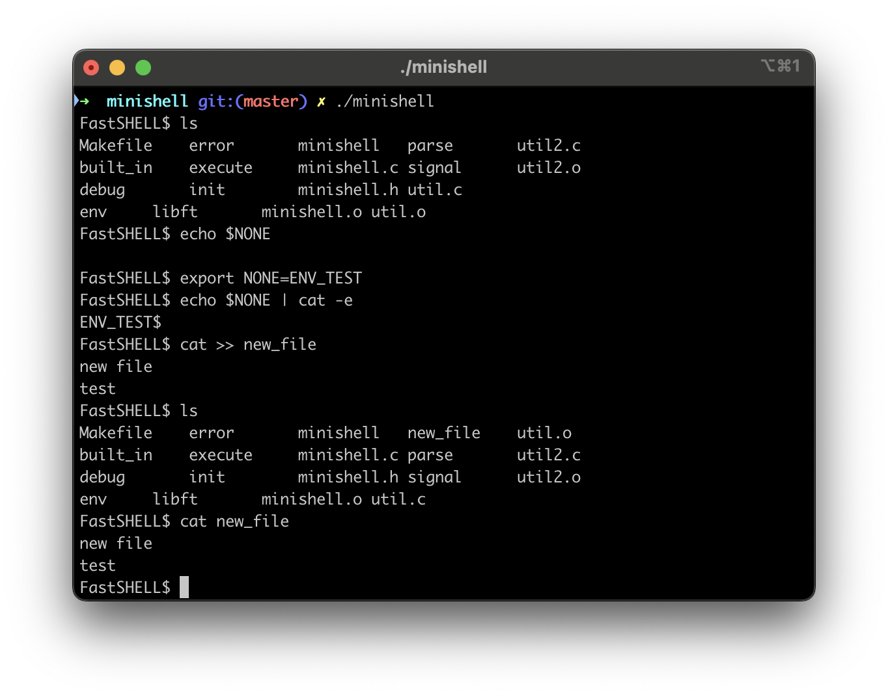
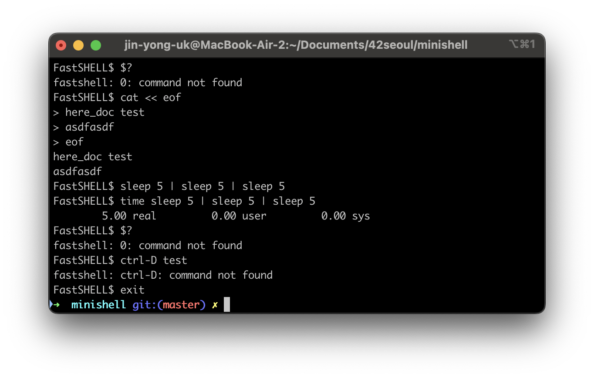

## Project Overview
> 42 Seoul Shell Implement Subject

운영체제의 프로세스 제어와 명령어 처리 원리를 직접 구현해보는 커스텀 쉘 프로젝트입니다.

Bash의 핵심 기능을 구현하고 프로세스 생명 주기, 파이프라인 데이터 흐름, 시그널을 관리합니다.




## Features
- Process Management
  - Fork-Execute: 명령어 처리를 위한 자식 프로세스 생성 및 병령 실행
  - Exit Code: waitpid를 이용해 프로세스 동기화 및 마지막 명령어의 Exit Code 사용
  - Pipe & Redirection: 파이프(|)와 파일 디스크립터(dup2)를 활용한 입출력 리디렉션 구현
- Error Handling: 기존 bash와 동일한 에러 처리 및 메시지 구현
- Signal Handling: 대기상태, 자식 프로세스, 부모 프로세스의 시그널 분리 처리
- Enviroment Variables: env 관리 및 $(env) 확장 기능 구현
- Commands
  - Built-in: cd, echo, export, unset, env, exit, pwd 직접 구현
  - Other Commands: fork 및 execve를 통해 구현

## Build & Run
For Mac OS

```
git clone https://github.com/roadl/MiniShell.git minishell
cd minishell
make
./minishell
```

## Development Enviroment
- OS: Sonoma 14.5
- Architecture: arm64 (Apple Silicon)
- Language: C (C99)
- Compiler: clang (Apple clang 15.0.0)
- Build Tool: make

## Team Members
[roadl](https://github.com/roadl)

[coffeesigma](https://github.com/coffeesigma)
